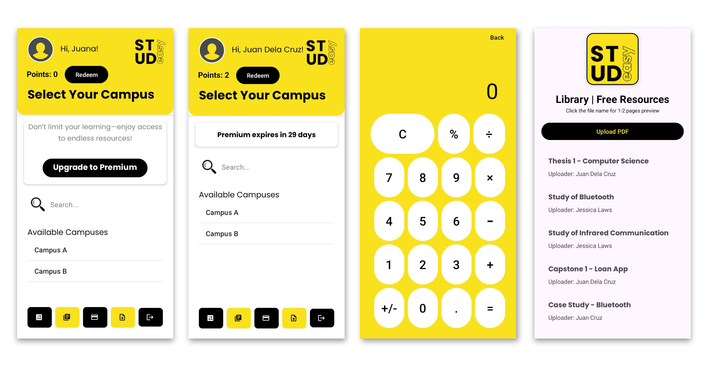
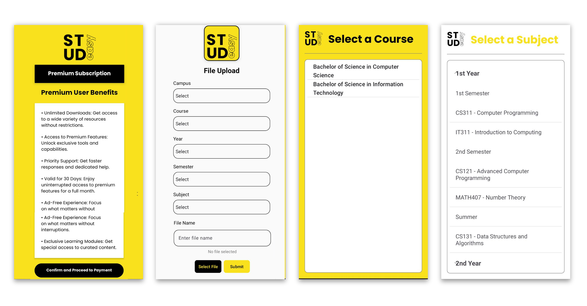
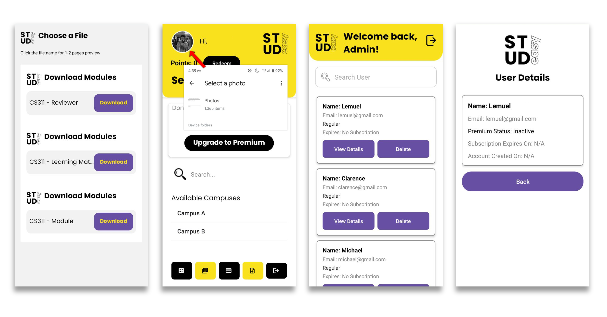

# Make Studying Easy with Studeezy
A platform dedicated to providing easy access to curriculum-aligned study resources, helping students stay ahead in their courses.

---

## Overview

Studeezy was created to help freshmen and continuing students who find it challenging to understand their curriculum and prepare effectively. The platform provides organized, curriculum-based study resources and promotes a collaborative environment where students and educators can contribute and discover valuable content.

---

## Features

### Key Features:
- **Curriculum-based Content Organization**: Access study materials tailored to your school, program, semester, and course.
- **Resource Sharing and Discovery**: Upload and find resources related to your curriculum for better learning.

---

---

## Business Model

### Freemium Model:
- **Free Tier**: Users can download up to 5 resources per month for free.
- **Premium Access**: ₱150/month grants unlimited access to all available resources.

### Incentive Program:
- **Content Rewards**: Users earn a fee for uploading high-quality, approved content.
- **Referral Program**: Invite friends and earn additional benefits such as free downloads or discounts.

---

## Future Plans

- **Collaborations with Schools and Universities**: Partner with educational institutions to preload curriculum materials for various programs.
- **Interactive Features**: Add tools for creating study groups, live Q&A, and interactive forums.
- **Daily Use Points** Add internal tools that users can access upon logging in, where they earn points for using these tools.

---

## Pull and Run in Android Studio

To pull and run the Studeezy project in Android Studio, follow these steps:

### 1. Clone the Repository
- Open **Android Studio**.
- Go to **File > New > Project from Version Control**.
- Select **Git** and enter the repository URL.
- Choose your directory and click **Clone**.

### 2. Open the Project
- Once the project is cloned, Android Studio will open the project automatically.
- If not, you can open it manually by going to **File > Open** and selecting the project folder.

### 3. Sync the Project
- Once the project is open, Android Studio may prompt you to sync the project with Gradle. Click **Sync Now** to download necessary dependencies and libraries.
- **Firebase Integration**: Since Firebase is already set up in the project, syncing will automatically link the app to Firebase services, including Realtime Database, Authentication, etc.

### 4. Set Up the Emulator or Device
- Ensure you have an Android emulator or a physical device connected.
- Go to **Tools > AVD Manager** to set up an emulator, or connect your device via USB and enable developer mode.

### 5. Run the Project
- Select your device or emulator from the target device dropdown.
- Click on the **Run** button (green triangle) in the toolbar.
- The project will build and launch on the selected device.

### 6. Troubleshooting (if needed)
- If there are any issues with Gradle sync or dependencies, you may need to check the **build.gradle** files and ensure that all necessary libraries are included.
- You can also try **File > Invalidate Caches / Restart** if the IDE behaves unexpectedly.
- If Firebase-related services (such as database connections or authentication) are not working, ensure that the `google-services.json` file is correctly placed in the `app/` folder of the project.
